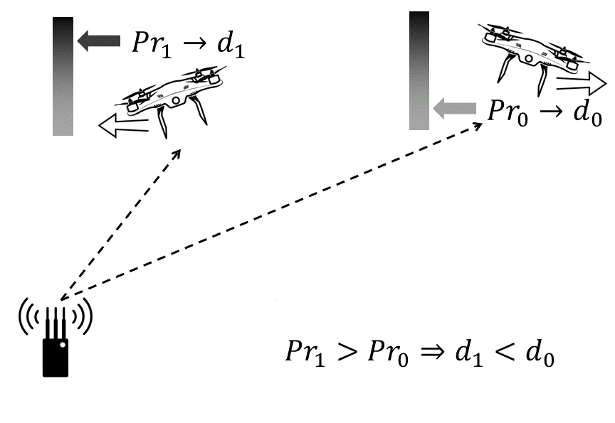

## JAM-ME
# Leveraging jamming to help drones complete their mission

     
     
     
     

     

<em>JAM-ME</em>: a solution that allows the drone to exploit an adversarial jamming signal to implement an emergency but yet effective navigation system that does not require any other type of on-board navigational sensor/instrument---the drone still being able to accomplish its mission.

## How it works

Description
