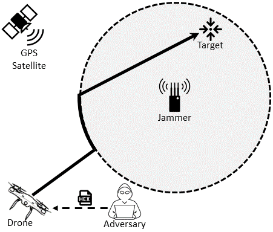

# JAM-ME: Leveraging jamming to help drones complete their mission

     
     
     
     

     

<em>JAM-ME</em>: a solution that allows the drone to exploit an adversarial jamming signal to implement an emergency but yet effective navigation system that does not require any other type of on-board navigational sensor/instrument---the drone still being able to accomplish its mission.

## How it works

We consider the following entities:
* **Drone**:An UAV flying from a source position to a target destination. We assume the drone not being remote controlled but pre-programmed according to a mission plan. The mission plan involves a set of way-points to reach a pre-determined target.
* **Adversary**: We assume the adversary is able to reprogram the drone and being able to change the mission plan parameters and all the flight control systems.
* **Target**: The destination point that the drone has to reach.
* **Jammer**: The radio device used to protect the target neighbourhood. We assume a very powerful, omnidirectional (with an isotropic antenna) jammer, being able to jam all the radio frequencies in the radio spectrum over a circle of radius *d*. As following, the <a href="https://en.wikipedia.org/wiki/Friis_transmission_equation">free-space model</a> adopted:

### *Assumptions in our scenario*
* *GPS* frequency *f* = 1575.42 MHz
* *c* is the speed of light
* *d* is the distance between the drone and the jammer
* *Pt* and *Pr* are the transmitted and the received power by the jammer and the drone, respectively
* Antenna Gains = 0 dBi

In order to prove the feasibility of drone navigation under jamming conditions, we consider the following challenging scenario configuration.

     

In the baseline scenario, a jammer is protecting an area against drones and UAV. Basically, the drone is programmed to fly over the area in order to reach the target. Since in the jammed area, the GPS will be not available to the drone, the adversary re-programs the firmware of the drone to leverage the jamming signal source as radio-beacon, and finally reach the target position.

* **Target position awareness**: The adversary (and therefore the drone) is aware of the target position. 

* **Unknown jammer position**: We assume the jammer position to be unknown; though it should be in the close neighbourhood of the target.

* **Unknown drift forces inside the jamming area**: We consider a scenario where the drone might be affected by an unknown wind drift.

* **INS**: We assume the worst case scenario according to which the drone does not resort to any navigation system based on sensors that might allow to compute its current position and planning the future trajectory. 

Finally, a *flight controller* is leveraged to allow the drone to fly towards a target, even in the presence of a jammer. As previously introduced, our idea mainly resorts to leverage the RSS estimated by the drone with respect to the jammer, so as to infer on the direction to take to reach the target.

* *For further details, please refer to the paper.*

## Requirements
* MATLAB release R2018b or newer
* Statistics and Machine Learning Toolbox

## How to run the code
In order to replicate a scenario with no wind and the target position not equal to the jammer position, you can execute the following `code` on the MATLAB Command Window:

`clc; clear all; d = drone(); d = d.setwinddir(-pi/2); d = d.set_wind_strength(0); d.target_pos = [8,11]; d.mov = [0.1 0]; d = d.fly(); d.show()
`

## Contributing
Pull requests are welcome. For major changes, please open an issue first to discuss what you would like to change.

## License
`JAM-ME` is released under the GNU General Public License v3.0 <a href="LICENSE">license</a>.
